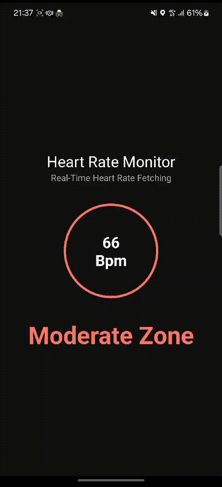

# Heart Rate Monitor Android

This Android application integrates with a health-related API from [HumanApi](https://reference.humanapi.co/v2.2/reference/heart-rate) with a Demo account to fetch real-time heart rate data. It processes the data, classifies it, and communicates with a device (simulated or real). The app also features a clean UI, real-time updates, and robust error handling.

## Tech Stack Overview

- Clean MVVM Architecture
- Retrofit
- Dependency Injection with Dagger
- BLE Device Scanner
- Local Notification
- Unit Testing with Mockito
- UI Testing with Espresso

## Preview
|  | 
| :---:                              | 
|   |

